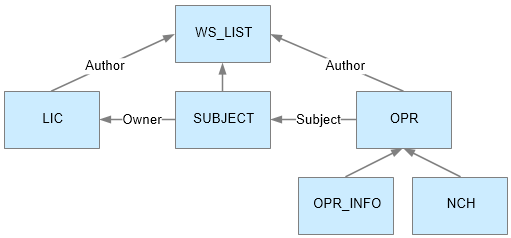

### Переменные, для использования в фильтрах

##### PARAM_wsAuthor

Рабочая станция - автор реплики (т.е. автор изменения записи, не путать с _автором записи_, это могут быть разные
рабочие станции)

##### PARAM_wsDestination

Рабочая станция - получатель реплики

##### PARAM_tableName

Имя таблицы, которой принадлежит запись

### PARAM_oprType

Вид операции: 1 - INS , 2 - UPD , 3 - DEL.

##### RECORD_XXX

Значение поля XXX в записи

Например:

~~~
RECORD_ID - Значение поля ID
RECORD_NAME - Значение поля NAME
~~~

##### RECORD_OWNER_XXX

Рабочая станция - владелец ссылки для ссылочного поля XXX в записи (т.е. рабочая станция, которая _создала_ эту ссылку,
не путать с _автором реплики_)

Например:

~~~
RECORD_OWNER_ID - Рабочая станция, на которой создана запись, т.е. автор исходной записи (или иначе - станция - "владелец" записи)
RECORD_OWNER_TABLE1 - Рабочая станция, на которой создана запись в таблице, на которую ссылается поле TABLE1
~~~

### Фильры по ссылкам

Декларирование условия:  

~~~
RECORD_REF:PAWNCHIT.WS_LIST in (2,8) && PARAM_wsAuthor = PARAM_wsDestination
~~~

Любая запись, должна НЕ ИМЕТЬ такой цепочки ссылок, которая приводит к нарушению условия. 
Например, таблица OPR хоть и не имеет ссылок на WS_LIST, и даже не имеет ссылок на PAWNCHIT, но она именет ссылку на PAWNCHITSUBJECT, 
который имеет ссылку на PAWNCHIT.WS_LIST, и в силу этого факта запись в OPR должна подвергаться фильтрации.

###### Проблема "фильтрация и обновление записей" 

Если мы фильтруем по филиалу, а билет постоянно перемещается по филиалам - как при этом формировать реплики для записи о билете?
Отправлять потом изменения БИЛЕТА на все филиалы, где билет хоть раз был?

###### Проблема "фильтрация и учет ссылок на позже обновленные записи"

Если мы фильтруем по филиалу, а билет постоянно перемещается по филиалам - как при этом фильтровать ОПЕРАЦИИ, ссылающиеся на этот билет?
Отправлять их на все филиалы, где билет хоть раз был?
